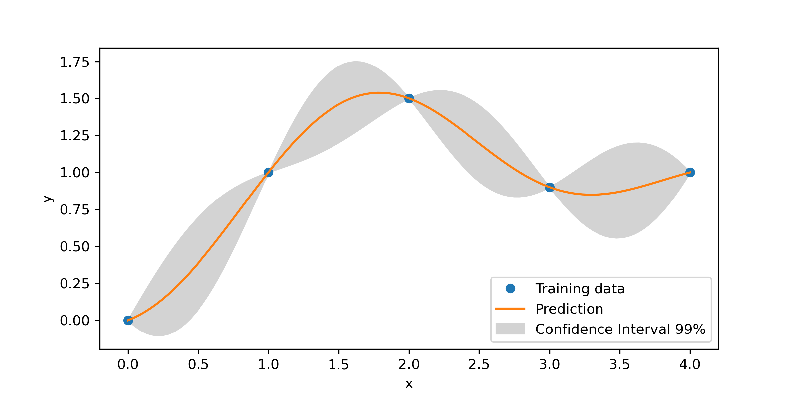
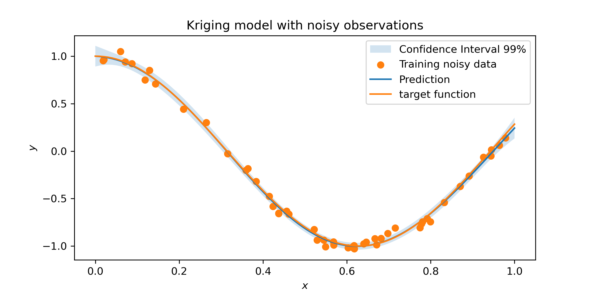

# pySBO
Surrogate-Based Optimization using Python

Two figures below obtained using the Kriging model from "SMT: Surrogate Modeling Toolbox".

### Interpolating-Kriging model using training data **without** noise

### Regressing-Kriging model using training data **with** noise

